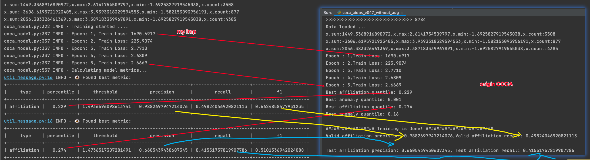
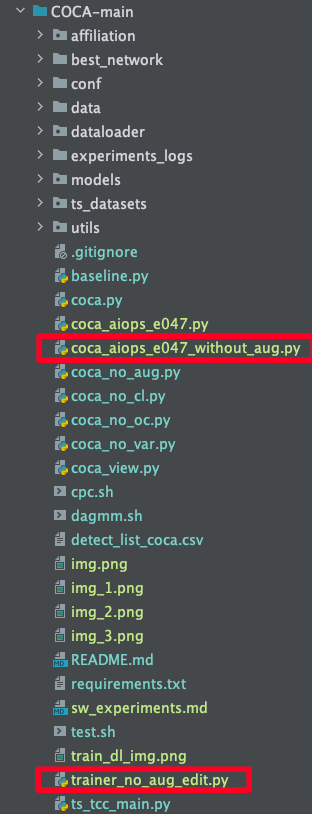

## This model is absolutely same as COCA
training loss reproduce and affiliation metric reproduce: 

if you want to reproduce, please following:
``` 
Beforehand, install COCA as a library (Marked COCA as `Source Root` in PyCharm)

# my implementation
python coca_verify_reproducable.py

# coca:
1. move the following two files to the COCA project directory (in the same directory as coca.py)

coca_aiops_e047_without_aug.py
trainer_no_aug_edit.py

2. run the script:
python coca_aiops_e047_without_aug.py
```

such as:
`coca_aiops_e047_without_aug.py` and `trainer_no_aug_edit.py` tree: 

## Why the affiliation metrics is greater than coca?
The strategy for labeling anomalies is different. 
- our: an anomaly window contain at least one anomaly point.
- coca:  an anomaly window  if the first `n` time step point is anomaly. `n` mean the value of `time_step`
