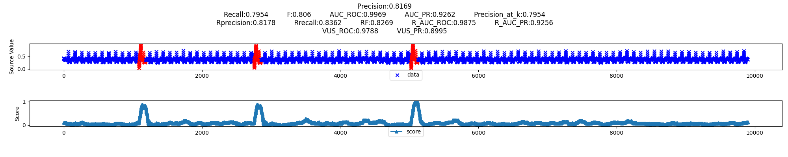
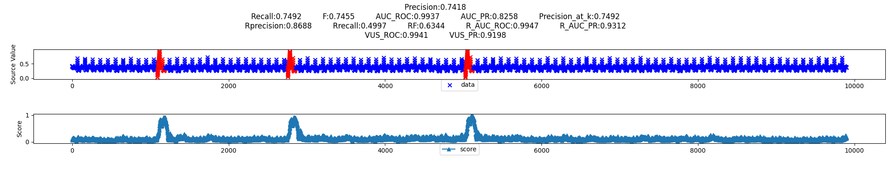
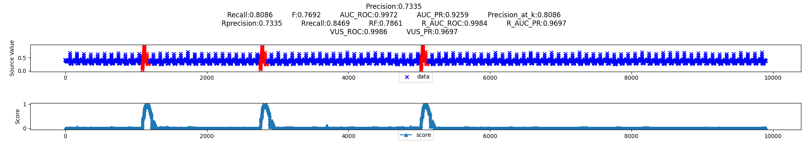
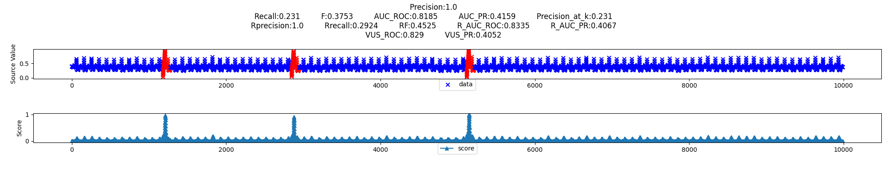
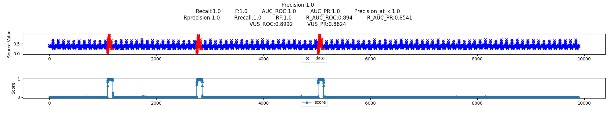
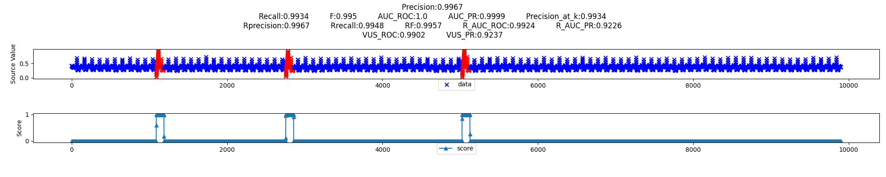

# AE

KPI ID = `MBA_ECG805_data.out`

# CNN

KPI ID = `MBA_ECG805_data.out`

# HBOS

KPI ID = `MBA_ECG805_data.out`

# IFOREST

KPI ID = `MBA_ECG805_data.out`

# LOF

KPI ID = `MBA_ECG805_data.out`

# LSTM

KPI ID = `MBA_ECG805_data.out`

# OCSVM

KPI ID = `MBA_ECG805_data.out`

# PCA

KPI ID = `MBA_ECG805_data.out`

# RANDOM_FOREST

KPI ID = `MBA_ECG805_data.out`

# SVM

KPI ID = `MBA_ECG805_data.out`

# VAE

KPI ID = `MBA_ECG805_data.out`

